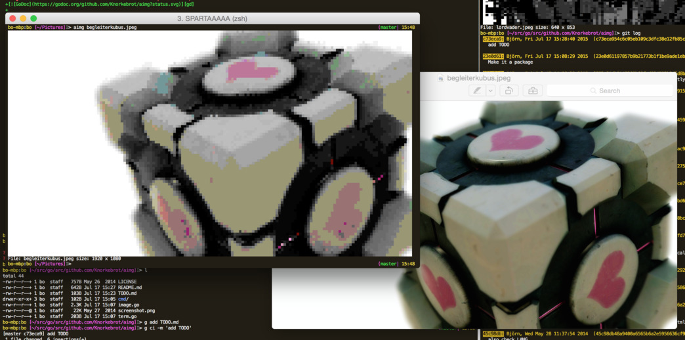

aimg
====

[][gd]

A package to convert images to ANSI color coded text. `aimg` uses
unicode UPPER HALF BLOCK to archieve twice the pixels (tm) per
character.

Usage
-----

As a package: see [GoDoc][gd]

As a command:

	> aimg -h
	Usage: aimg [-w (num | num% | .num) ] file [file...]
	  -w, --width="100%": Output width. Supports column count, percentage and decimals.

Get the cli tool
----------------

	> go get github.com/Knorkebrot/aimg/cmd/aimg

That's it :)

- - - -

Inspired by [minikomi's ansipix][ap].

[ap]: https://github.com/minikomi/ansipix
[gd]: https://godoc.org/github.com/Knorkebrot/aimg
