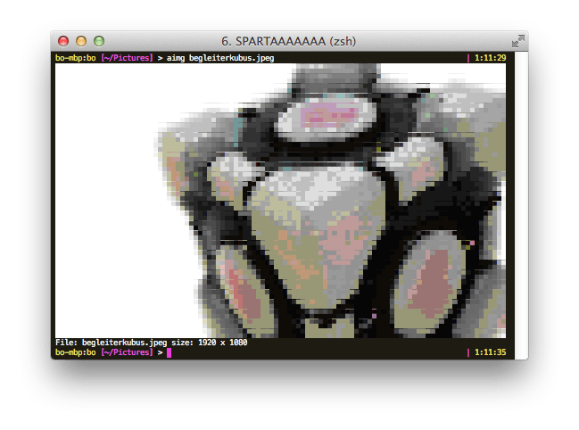

aimg
====

An image to ANSI color coded text converter.  
aimg uses unicode UPPER HALF BLOCK to archieve twice the pixels (tm) per character.

Usage
-------

	> aimg -h
	Usage: aimg file [file...]
	  -w=0: Output width, use 0 for terminal width

Installation
------------

	> go get github.com/Knorkebrot/aimg

That's it, you're done.

- - - -

Inspired by [minikomi's ansipix][1].

[1]: https://github.com/minikomi/ansipix
